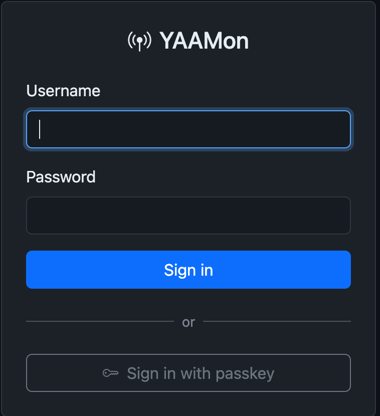
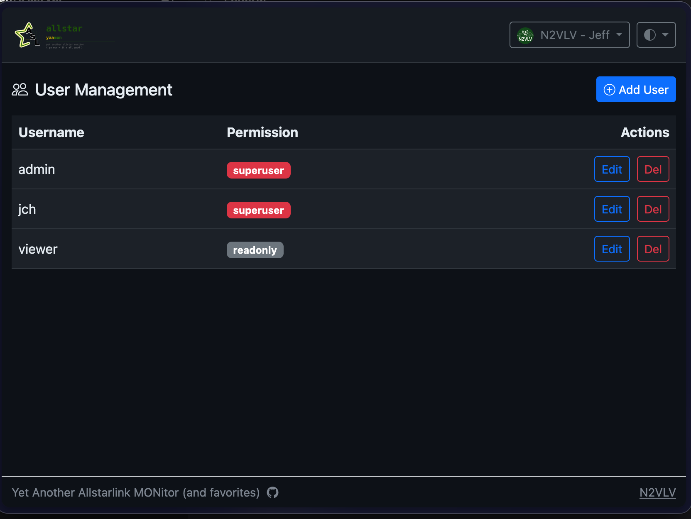
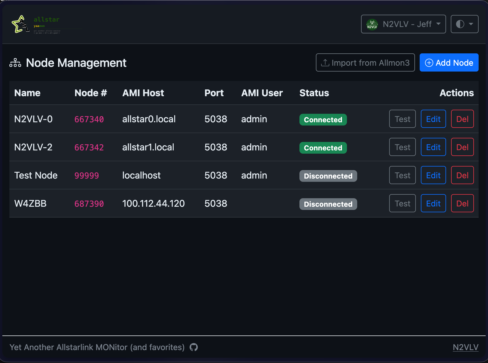
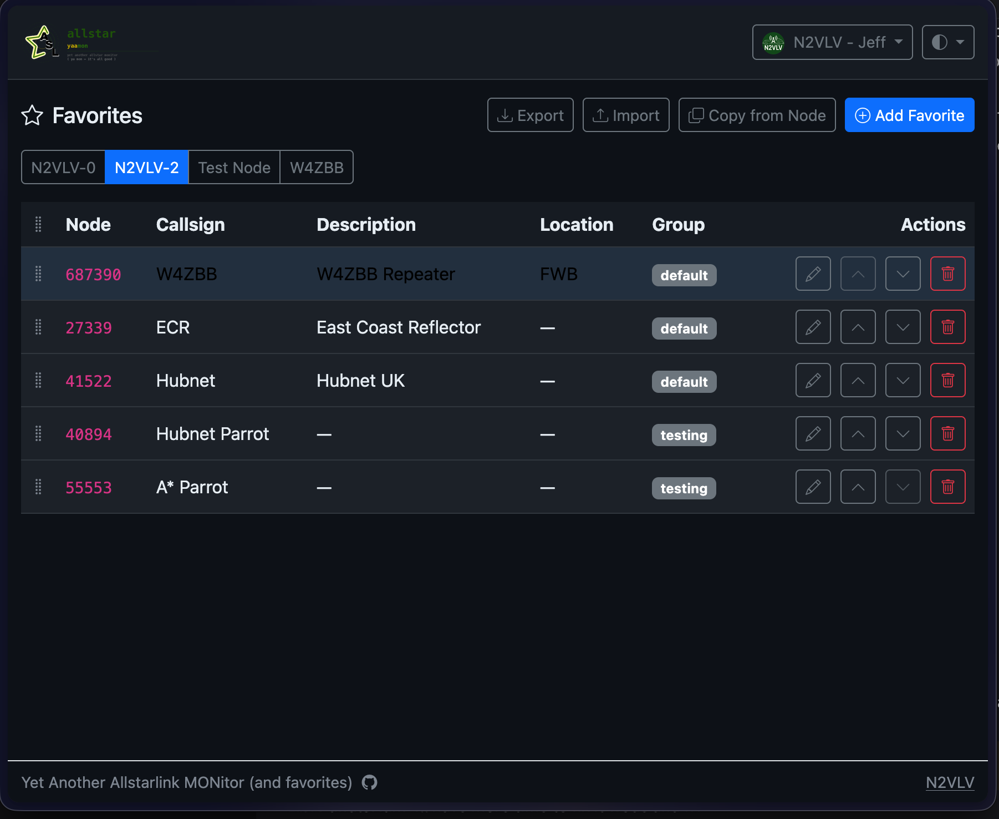
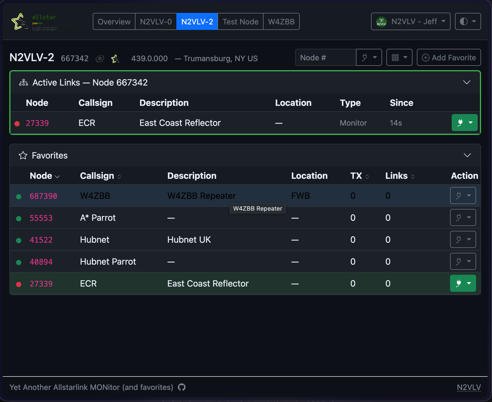

# YAAMon Documentation

> For the full CLI command reference see [REFERENCE.md](REFERENCE.md).

- [First-Time Setup](#first-time-setup)
- [User Roles](#user-roles)
- [Managing Users](#managing-users)
- [Adding Nodes](#adding-nodes)
- [Remote Nodes](#remote-nodes)
- [Favorites](#favorites)
- [The Dashboard](#the-dashboard)
- [Overview Page](#overview-page)
- [Node Pages](#node-pages)
- [Your Profile](#your-profile)
- [Themes](#themes)
- [Backup and Restore](#backup-and-restore)
- [Proxy Authentication (OAuth2 / oauth2-proxy)](#proxy-authentication-oauth2--oauth2-proxy)
- [Tailscale Authentication](#tailscale-authentication)
- [Troubleshooting](#troubleshooting)
- [Docker — Bind-mount Ownership (PUID / PGID)](#docker--bind-mount-ownership-puid--pgid)
- [Declarative State (yaamon apply)](#declarative-state-yaamon-apply)

---

## First-Time Setup

<!-- IMAGE: /setup page — username and password fields, "Create Account" button -->

When you open YAAMon for the first time — before any users exist — you are redirected to `/setup`. Enter a username and password for your initial superuser account. This account has full administrative access.

After creating the account you are taken to the login page. Sign in with the credentials you just created.



> If you need to bootstrap a fresh install non-interactively (e.g., in a Docker environment), set `YAAMON_STATE_FILE` to the path of a state file — it will be applied automatically on container start. See [Declarative State](#declarative-state-yaamon-apply).

---

## User Roles

YAAMon has four permission levels, from least to most access:

| Role | Can do |
|------|--------|
| **readonly** | View the dashboard, node stats, and connection graph. Cannot change anything. |
| **readwrite** | Everything readonly can do, plus connect/disconnect nodes and manage favorites. |
| **admin** | Everything readwrite can do, plus add/edit/remove nodes and users, upload a favicon, and take backups. |
| **superuser** | Everything admin can do. Superusers cannot be demoted or deleted by admins — only by other superusers. |

A newly installed system requires at least one superuser. You cannot delete or demote the last superuser account.

---

## Managing Users



Go to **Admin → Users** (top-right menu, admin and superuser accounts only).

### Adding a user

Click **Add User**, enter a username, password, and choose a role. The user can log in immediately and change their own password from their profile.

### Changing a user's role

Click the role badge next to the user's name and select a new role from the dropdown. Changes take effect on the user's next page load — their existing session is not invalidated, but the new permission level is checked on every request.

### Deleting a user

Click the trash icon next to the user. You will be asked to confirm. If the user is currently logged in their session becomes invalid on the next request.

> You cannot delete or demote the last superuser account.

### Passwords

Users can change their own password from [My Profile](#your-profile). Admins and superusers can reset any user's password from the Users page.

---

## Adding Nodes



Go to **Admin → Nodes** (top-right menu, admin and superuser accounts only).

### Importing from Allmon3

<!-- IMAGE: Allmon3 import modal — checklist of parsed nodes with "existing" badges, Import Selected button -->

If you are migrating from Allmon3, click **Import from Allmon3** and select your `allmon3.ini` file (usually `/etc/allmon3/allmon3.ini`). YAAMon parses the file and lists all nodes found. Nodes already present in YAAMon are unchecked by default. Check the ones you want to import and click **Import Selected**.

Imported nodes use their node number as the display name — rename them afterwards using the edit button. AMI credentials are read directly from the file.

### Adding a node manually

Click **Add Node** and fill in:

| Field | Description |
|-------|-------------|
| **Name** | A friendly label shown in the UI — use your call sign or a descriptive name |
| **Node number** | Your AllStarLink node number (digits only) |
| **AMI host** | Hostname or IP of the Asterisk server. Use `localhost` if YAAMon runs on the same machine as Asterisk |
| **AMI port** | Asterisk Manager port — default is `5038` |
| **AMI username** | The `user` defined in `/etc/asterisk/manager.conf` |
| **AMI password** | The `secret` for that manager user |
| **Enabled** | Uncheck to disable the AMI connection without deleting the node |

After saving, YAAMon connects to the AMI immediately. A green dot on the node card indicates a live connection; a red dot means the connection failed (check the AMI credentials and firewall).

### Minimum manager.conf entry

**When YAAMon runs on the same machine as Asterisk** (AMI host = `localhost`):

```ini
[general]
enabled = yes
bindaddr = 127.0.0.1        ; listen on loopback only — safest default

[yaamon]
secret = your-secret-here
read = system,call,log,verbose,agent,user,config,dtmf,reporting,cdr,dialplan
write = system,call,agent,user,config,command,reporting,originate
permit = 127.0.0.1/255.255.255.255
```

**When YAAMon runs on a different machine** (e.g., a Docker host or separate server), Asterisk must listen on a network interface and permit connections from the YAAMon host's address:

```ini
[general]
enabled = yes
bindaddr = 0.0.0.0          ; or the specific interface IP facing YAAMon

[yaamon]
secret = your-secret-here
read = system,call,log,verbose,agent,user,config,dtmf,reporting,cdr,dialplan
write = system,call,agent,user,config,command,reporting,originate
permit = 192.168.1.50/255.255.255.255   ; replace with YAAMon host's IP
deny = 0.0.0.0/0.0.0.0
```

Reload the manager module after any changes:

```bash
sudo asterisk -rx "module reload manager"
```

> **Security**: AMI has no encryption. If YAAMon is not on the same machine, use a VPN or SSH tunnel and keep `bindaddr` restricted to the VPN/tunnel interface rather than `0.0.0.0`. See [Remote Nodes](#remote-nodes).

---

## Remote Nodes

YAAMon can manage nodes on other machines by pointing the AMI host at a remote IP address. **AMI transmits credentials in plain text**, so how you secure the connection depends on where the remote node is.

### Nodes on the same local network

Plain AMI over a trusted LAN is acceptable for many home setups, using `permit` to restrict access to the YAAMon host's IP (see [Minimum manager.conf entry](#minimum-managerconf-entry) above).

AMI over TLS would be the right solution for untrusted local networks, but it is not yet implemented in YAAMon.

### Nodes on a different network (internet-connected)

**Never expose AMI port 5038 directly to the internet.** For nodes that are not on the same local network, the AMI connection must be secured with a tunnel.

#### Option A — VPN (recommended)

Put the YAAMon host and the remote node on the same VPN (WireGuard or OpenVPN). Use the remote node's VPN IP address as the AMI host. No firewall holes are needed on the remote node's public interface, and all traffic is encrypted.

#### Option B — SSH tunnel

On the YAAMon host, open a persistent tunnel to the remote node:

```bash
ssh -N -L 5038:localhost:5038 youruser@remote-node-ip
```

Then set the AMI host to `127.0.0.1` and port `5038` in YAAMon. The tunnel forwards the local port to the remote Asterisk over an encrypted SSH connection.

For a persistent tunnel, use `autossh`:

```bash
autossh -M 0 -N -L 5038:localhost:5038 youruser@remote-node-ip
```

Or configure it as a systemd service.

### manager.conf on the remote node

Restrict the AMI `permit` line to the YAAMon host's VPN or tunnel address:

```ini
[yaamon]
secret = your-secret-here
read = system,call,log,verbose,agent,user,config,dtmf,reporting,cdr,dialplan
write = system,call,agent,user,config,command,reporting,originate
permit = 10.0.0.2/255.255.255.255    ; YAAMon host VPN address only
deny = 0.0.0.0/0.0.0.0
```

Reload the manager module after editing:

```bash
sudo asterisk -rx "module reload manager"
```

---

## Favorites



Favorites are the nodes you frequently connect to, organized per node. They appear as quick-connect buttons on the dashboard.

### Adding favorites

Go to **Favorites** (top-right menu, readwrite and above). Select the node you want to manage favorites for. Click **Add Favorite** and fill in:

| Field | Description |
|-------|-------------|
| **Node number** | The remote AllStarLink node number to connect to |
| **Callsign** | Optional — shown on the button |
| **Description** | A longer label for the node |
| **Location** | City, state, or other location info |
| **Group** | Organize favorites into named groups (tabs on the dashboard) |

### Reordering

Drag and drop favorites within a group to reorder them. The order is saved immediately.

### Copying favorites

You can copy all favorites from one node to another using the **Copy from node** button at the top of the Favorites page. Useful when you add a second node and want the same set of favorites.

### Importing favorites from AllScan

On the Favorites page, click **Import**. Select your AllScan `favorites.ini` file (usually `/var/www/html/allscan/favorites.ini`). YAAMon parses the file, extracts node numbers and labels, and attempts to split each label into a callsign and description. A preview shows how many entries will be added and how many will be skipped (already exist). Confirm to import.

AllScan labels often follow the pattern `CALLSIGN Description` — YAAMon recognises a leading word as a callsign if it is 3–7 alphanumeric characters and contains at least one digit. You can edit any favorite after import to correct the split.

---

## The Dashboard



The dashboard is the main view. It shows live stats for your connected node(s) and lets you connect and disconnect.

### Selecting a node

If you have more than one node, the navbar shows either a button group (on wider screens) or a dropdown (on narrow screens) with **Overview** and each of your nodes. Click a node name to switch to its dashboard. Click **Overview** for the multi-node summary.

### Connecting to a favorite

Click any favorite button to send a connect command to that node via AMI. The button highlights when the connection is active. Click it again (or click **Disconnect**) to disconnect.

### Live updates

The dashboard uses Server-Sent Events (SSE) to push live stats — you do not need to refresh the page. The connection indicator in the corner shows whether the live feed is active.

---

## Overview Page


The Overview page is shown when you have more than one node and click **Overview** in the nav. It displays a summary card for each node showing:

- Connection status (green/red dot)
- Node number and name
- Number of active connections
- Whether the node is currently keyed

Click a node card to jump to that node's full dashboard.

---

## Node Pages

Each node's dashboard shows:

### Connection list

The active connections table lists every node currently linked, with:
- Node number (click to open the AllStarLink page for that node)
- Callsign and location (pulled from the AllStarLink node database)
- Direction (inbound / outbound)
- Duration of the current connection
- Whether the remote node is currently keyed

Hovering over a node number shows a tooltip with additional AllStarLink stats when available.

### Favorites panel

Your favorites for this node are shown as buttons, organized by group. Buttons for active connections are highlighted. Click to connect; click again to disconnect.

### Network graph

<!-- IMAGE: Network graph — interactive bubble chart showing connected nodes with callsigns, edges indicating link direction -->

Click the graph icon on any connection row to open an interactive network graph showing how the connected nodes link to each other. The graph is also available as a full-page view.

---

## Your Profile


Click your name or avatar in the top-right corner and choose **My Profile**.

### Avatar

You can set an avatar two ways:

- **Upload an image** — click **Choose…**, pick a PNG, JPEG, GIF, or WebP image (max 2 MB), then click **Upload**. The image is stored in YAAMon's database.
- **Link to a URL** — paste an external image URL into the "Or link to an avatar URL" field and save. The browser fetches the image directly from that URL on each page load.

Click **Remove** to clear the avatar entirely.

### Full name

Enter your name in the **Full Name** field. It appears in the navbar dropdown in place of your username.

### Password

Enter your current password and a new password to change it. Passwords must be at least 8 characters. Leave both fields blank to keep the current password.

> Accounts created automatically by proxy auth (OAuth2) have password-based login disabled. The password fields are not available for those accounts.

### Tailscale Usernames

If your site uses [Tailscale authentication](#tailscale-authentication), enter your Tailscale login name (e.g. `jch@honig.net`) here. Separate multiple logins with commas. When a request arrives from Tailscale with a matching identity header, you will be logged in automatically without a password.

### Callsign Lookup

Choose which source to use for callsign lookups on the dashboard:

| Option | Description |
|--------|-------------|
| **Automatic** | Uses QRZ.com when credentials are configured, otherwise callook.info (US only) |
| **callook.info** | Always use callook.info (free, US callsigns only) |
| **QRZ.com** | Always use QRZ.com (requires a QRZ.com subscription) |

To configure QRZ.com credentials, expand **QRZ.com Credentials**, enter your QRZ.com username and password, and click **Save QRZ**. Click **Remove** to clear stored credentials, or **Clear cache** to force fresh lookups.

---

## Themes


Click the half-circle icon in the top-right corner to switch themes:

| Theme | Description |
|-------|-------------|
| **System** | Follows your OS dark/light mode preference |
| **Dark** | Dark background (default) |
| **Light** | Light background |
| **Solarized** | Solarized color palette |
| **High Contrast** | Maximum contrast for accessibility |

Your choice is saved in browser local storage and persists across sessions.

---

## Backup and Restore

<!-- IMAGE: Backup page — "Download Backup" button with optional passphrase field, Restore upload section -->

Go to **Admin → Backup** (admin and superuser accounts only).

### Creating a backup

Click **Download Backup**. YAAMon exports the entire database — users, nodes, favorites, and configuration — as a compressed `.owbackup` file. Optionally enter a passphrase to encrypt the backup before download.

From the command line:

```bash
yaamon backup -o /path/to/backup.owbackup
yaamon backup -o /path/to/backup.owbackup --passphrase "your passphrase"
```

### Inspecting a backup

Before restoring, you can inspect a backup file to see what it contains without applying it:

```bash
yaamon inspect /path/to/backup.owbackup
```

### Restoring

On the Backup page, click **Restore** and upload a `.owbackup` file. If the backup is encrypted, enter the passphrase. YAAMon takes an automatic safety backup of the current database before overwriting it.

From the command line:

```bash
yaamon restore /path/to/backup.owbackup
yaamon restore /path/to/backup.owbackup --passphrase "your passphrase"
```

> **Warning**: Restore replaces the entire database. All current users, nodes, and favorites are overwritten.

---

## AllStarLink Node Database (astdb)

YAAMon automatically downloads the AllStarLink node database from `allmondb.allstarlink.org` and uses it to populate callsign, description, and location fields for nodes and favorites that are not manually configured. The database is refreshed every hour using a conditional request (If-Modified-Since), so bandwidth use is minimal.

### File location

| Deployment | Default path |
|---|---|
| Standard Asterisk install | `/var/lib/asterisk/astdb.txt` |
| Docker (no Asterisk on host) | `/var/lib/yaamon/astdb.txt` |

The path is configurable. The file is written atomically (temp file → rename) so readers never see a partial update.

### Configuration

```yaml
astdb:
  # Path to the node database file.
  # Standard install: /var/lib/asterisk/astdb.txt  (default)
  # Docker:           /var/lib/yaamon/astdb.txt
  path: /var/lib/asterisk/astdb.txt

  # update: true  — download fresh data on startup and every hour (default).
  # update: false — read the existing file only; make no network requests.
  #   Use false when Asterisk is co-located and already keeps the file current,
  #   or when the host has no internet access.
  update: true
```

Environment-variable equivalents (for Docker):

```
YAAMON_ASTDB_PATH=/var/lib/yaamon/astdb.txt
YAAMON_ASTDB_UPDATE=false
```

### Docker example

```yaml
services:
  yaamon:
    image: ghcr.io/jchonig/yaamon:latest
    environment:
      - YAAMON_ASTDB_PATH=/var/lib/yaamon/astdb.txt
    volumes:
      - ./data:/var/lib/yaamon
```

If you prefer to share Asterisk's own copy of the file, bind-mount the Asterisk directory instead and set `update: false`:

```yaml
services:
  yaamon:
    image: ghcr.io/jchonig/yaamon:latest
    environment:
      - YAAMON_ASTDB_PATH=/asterisk/astdb.txt
      - YAAMON_ASTDB_UPDATE=false
    volumes:
      - /var/lib/asterisk:/asterisk:ro
      - ./data:/var/lib/yaamon
```

---

## Proxy Authentication (OAuth2 / oauth2-proxy)

When YAAMon sits behind an [oauth2-proxy](https://oauth2-proxy.github.io/oauth2-proxy/) reverse proxy (or any proxy that injects `X-Auth-Request-*` headers), it can derive a session automatically from those headers without requiring users to log in through the YAAMon login page.

### How it works

On every request the proxy injects headers identifying the authenticated user. YAAMon reads the username and group membership from those headers and maps the user's groups to a YAAMon role. No session cookie is written — the session is re-derived from the headers on every request.

If the user does not yet have a YAAMon account and `create_users: true` (the default), an account is created automatically with the mapped role. The password is stored as `*`, which prevents local login — the account is only usable via proxy auth.

### Configuration

```yaml
proxy_auth:
  enabled: false

  # Header that carries the authenticated username.
  # For oauth2-proxy with the preferred_username claim:
  username_header: X-Auth-Request-Preferred-Username

  # Header that carries the comma-separated group claim values.
  groups_header: X-Auth-Request-Groups

  # Map group claim values to YAAMon roles (group → role).
  # YAAMon grants the highest role found across all groups the user belongs to.
  # If the user is in none of these groups, the request is denied (403).
  # This mapping MUST be configured — if it is empty, every proxy-auth request
  # is denied and a WARN is logged explaining what is missing.
  group_roles:
    yaamon_superadmin: superuser
    yaamon_admin:      admin
    yaamon_rw:         readwrite
    yaamon_access:     readonly

  # Create a DB account on first proxy-auth login (default: true).
  # Set to false to require pre-created accounts.
  create_users: true

  # If true, update the DB account's stored role to the OAuth-mapped role on
  # every successful auth. If false (default), the DB role is ignored while the
  # proxy is active — the OAuth-mapped role always governs the session.
  update_db_role: false
```

### Security considerations

YAAMon trusts the proxy headers unconditionally. Ensure that:

- YAAMon is **not reachable directly** from the internet or from untrusted clients — only the proxy should be able to reach it.
- The proxy is configured to **strip** any incoming `X-Auth-Request-*` headers from external requests before adding its own.

When `proxy_auth.enabled: true`, the local login page still works for accounts that do not have the `*` password sentinel. This allows a fallback superuser created during initial setup to log in even when the proxy is not in front, which is useful for testing and emergency access.

### Auth indicator

When a session is established via proxy auth, a shield icon (🛡) appears next to your username in the top-right dropdown. Hover over it to see `Authenticated via OAuth2`.

---

## Tailscale Authentication

When YAAMon sits behind [caddy-tailscale](https://github.com/tailscale/caddy-tailscale), it can automatically log in users arriving from the Tailscale network without a password.

### How it works

caddy-tailscale's `tailscale_auth` directive identifies the Tailscale user making each request and populates Caddy auth user fields. Those fields are then mapped to HTTP headers by the `reverse_proxy` block and forwarded to YAAMon. YAAMon reads the login name from the configured header and looks for a YAAMon DB user whose **Tailscale Usernames** profile field contains that login. If found, the user is logged in with their DB role. If not found, YAAMon falls through to the cookie session (if any) or the login page — users without a Tailscale mapping can still log in with a password.

Unlike OAuth2 proxy auth, Tailscale auth **does not create users automatically**. The mapping must be configured by editing the user's profile.

> **Note:** `tailscale_auth` identifies the *connecting user's* device. It does not work when the connecting client is itself a tagged (service) device, only for user-owned devices.

### Caddyfile configuration

The `tailscale_auth` directive must appear before `reverse_proxy`, and the Caddy auth user fields must be explicitly mapped to headers:

```caddyfile
https://yaamon.example.ts.net {
    bind tailscale/yaamon

    tailscale_auth

    reverse_proxy yaamon:80 {
        header_up Tailscale-User-Login       {http.auth.user.tailscale_user}
        header_up Tailscale-User-Name        {http.auth.user.tailscale_name}
        header_up Tailscale-User-Profile-Pic {http.auth.user.tailscale_profile_picture}
    }
}
```

Use `tailscale_user` (not `tailscale_login`) for the login header — `tailscale_user` is the full namespace-qualified ID (e.g. `jchonig@github`) while `tailscale_login` is just the username portion (`jchonig`). Using the full ID avoids ambiguity when users from different Tailscale tailnets might share the same short username.

### YAAMon configuration

```yaml
tailscale_auth:
  enabled: true

  # Header carrying the Tailscale login name (e.g. jch@honig.net).
  # Must match the header_up name in the Caddyfile.
  user_header: Tailscale-User-Login

  # Optional headers for display name and avatar URL.
  name_header:   Tailscale-User-Name
  avatar_header: Tailscale-User-Profile-Pic
```

### Mapping a DB user to a Tailscale login

Each user can list one or more Tailscale login names in their profile. When a request arrives with a matching `Tailscale-User-Login` header, that user is automatically logged in.

**Self-service (users):** Open **My Profile** from the top-right dropdown. Enter your Tailscale login name (e.g. `jch@honig.net`) in the **Tailscale Usernames** field. Separate multiple logins with commas if you have more than one Tailscale identity.

**Admin:** Admins and superusers can set the Tailscale Usernames field for any user on the **Admin → Users** page.

### Display name and avatar

If your YAAMon profile has no display name or avatar set, they are filled in opportunistically from the Tailscale headers (`Tailscale-User-Name` and `Tailscale-User-Profile-Pic`) for that request. To make the values permanent, save them in your profile.

### Auth indicator

When a session is established via Tailscale auth, a shield icon (🛡) appears next to your username in the top-right dropdown. Hover over it to see `Authenticated via tailscale`. If the Tailscale login name differs from your YAAMon username (e.g. you logged in as `jch@honig.net` but your account is `jch`), the Tailscale login is shown in parentheses: `Authenticated via tailscale (jch@honig.net)`.

---

## Passkeys (WebAuthn / FIDO2)

The Passkeys panel is visible in the [My Profile screenshot](#your-profile) above.

Passkeys let users authenticate without a password using a platform authenticator (Touch ID, Face ID, Windows Hello) or a hardware security key (YubiKey, etc.). Any FIDO2-compatible password manager — Bitwarden, 1Password, iCloud Keychain — also works as a passkey provider.

### How it works

1. A registered user opens their **Profile → Passkeys** panel and clicks **Add passkey**.
2. The browser prompts them to use an authenticator. A resident key (discoverable credential) is stored on the device or in their password manager.
3. On subsequent logins the user clicks **Sign in with passkey** on the login page. The browser presents the stored credential, no username or password is needed.

### Zero-config operation

YAAMon derives the WebAuthn Relying Party ID and origin automatically from the `Origin` (or `Host`) header of each request. This means passkeys work out of the box with any hostname — no additional configuration is required for most deployments.

### Configuration

Explicit configuration is only needed when the automatic derivation would produce the wrong hostname (e.g., when accessed behind a reverse proxy that rewrites the `Origin` header):

```yaml
webauthn:
  rpid: "yourdomain.example"          # Relying Party ID — must be a registered domain suffix
  rp_origins:
    - "https://yourdomain.example"    # List of allowed origins
```

| Key | Default | Description |
|-----|---------|-------------|
| `webauthn.rpid` | derived from `Origin`/`Host` header | Relying Party ID (domain, no port) |
| `webauthn.rp_origins` | derived from `Origin`/`Host` header | Allowed WebAuthn origins |

When `webauthn.rpid` and `webauthn.rp_origins` are both set, the configured values take precedence for all ceremonies.

### Registering a passkey

1. Log in with your username and password.
2. Open the user menu (top-right) and click **Profile**.
3. Scroll to the **Passkeys** section and click **Add passkey**.
4. Follow the browser prompt to create the credential.
5. Optionally give the passkey a descriptive name (e.g. "MacBook Pro Touch ID") in the dialog.

### Signing in with a passkey

On the login page (see [login screenshot](#first-time-setup) above), click **Sign in with passkey** below the password form. The browser will present any stored credentials for the site.

### Managing passkeys

In the **Passkeys** section of the Profile modal:

- **Rename** — click the pencil icon next to any passkey to give it a new name.
- **Delete** — click the trash icon to remove a passkey.

#### Safety guard

If a passkey is the last one associated with an account **and** the account has no password set (passkey-only accounts created without a password), deletion is blocked with a `409 Conflict` error. This prevents being locked out. Set a password first, or add a second passkey, before removing the last one.

---

## Troubleshooting

### Enabling debug logging

Set the log level to `debug` in `config.yaml` (or via environment variable) to see detailed diagnostic output:

```yaml
log:
  level: debug
```

```bash
YAAMON_LOG_LEVEL=debug
```

### Proxy auth / Tailscale auth not working

With debug logging enabled, the auth middleware logs a message on every request explaining what it found. Look for lines with `tailscale auth` or `oauth2 auth`:

| Message | Meaning |
|---------|---------|
| `tailscale auth: header absent` | The configured `user_header` was not present in the request. The Caddyfile is missing the `tailscale_auth` directive, or caddy-tailscale is not in use. |
| `tailscale auth: no matching user` | The header was present but no DB user has that Tailscale login in their **Tailscale Usernames** profile field. Add the login via **My Profile** or **Admin → Users**. |
| `tailscale auth: matched user` | Tailscale auth succeeded — session established. |
| `oauth2 auth: header absent` | The configured `username_header` was not present. The proxy (oauth2-proxy / Caddy) is not injecting auth headers. |
| *(no `oauth2 auth` log lines at all)* | `proxy_auth.enabled` is `false` (the default). If you see no `oauth2 auth` lines even with debug logging, check that `proxy_auth.enabled: true` is explicitly in your `config.yaml`. |
| `oauth2 auth: group_roles is not configured` | `proxy_auth.enabled: true` but `group_roles` is empty. Add a `group_roles` mapping to `config.yaml`. All requests are denied until this is configured. |
| `oauth2 auth: no matching group` | The username header was present but none of the user's groups appear in `group_roles`. Check the group names in the log against your `group_roles` mapping. |
| `oauth2 auth: matched role` | OAuth2 auth succeeded — session established with the mapped role. |

### Checklist for Tailscale auth

1. **`tailscale_auth.enabled: true`** is set in `config.yaml`.
2. The Caddyfile has **`tailscale_auth`** before `reverse_proxy`.
3. The `reverse_proxy` block has **`header_up`** lines mapping the Caddy auth user fields to the headers YAAMon expects:
   ```caddyfile
   header_up Tailscale-User-Login       {http.auth.user.tailscale_login}
   header_up Tailscale-User-Name        {http.auth.user.tailscale_name}
   header_up Tailscale-User-Profile-Pic {http.auth.user.tailscale_profile_picture}
   ```
   Without these, `tailscale_auth` authenticates the request but no identity is forwarded to YAAMon.
4. The user has their Tailscale login (e.g. `jch@honig.net`) in their **Tailscale Usernames** field. Open **My Profile** — if you are connecting through caddy-tailscale an **Add \<login\>** button appears automatically when the login is not yet mapped.
5. YAAMon is not directly reachable from clients — only Caddy should reach it, otherwise headers can be spoofed.

### Checklist for OAuth2 / oauth2-proxy auth

1. **`proxy_auth.enabled: true`** is set in `config.yaml`. This key defaults to `false` — if it is absent or `false`, the middleware is completely bypassed and no `oauth2 auth` log lines appear, even with debug logging.
2. The `username_header` and `groups_header` values match what oauth2-proxy injects (defaults are `X-Auth-Request-Preferred-Username` and `X-Auth-Request-Groups`).
3. **`group_roles`** is configured with at least one group → role mapping. If it is empty, every proxy-auth request is denied (403) and a WARN is logged.
4. The user's Kanidm (or other OIDC provider) groups appear in `group_roles`.
5. oauth2-proxy is configured with `set-xauthrequest = true` (or equivalent) to inject the headers.
6. YAAMon is not directly reachable from clients — only the proxy should reach it.

---

## Docker — Bind-mount Ownership (PUID / PGID)

When using a bind-mount for `/var/lib/yaamon`, the host directory must be writable by the container process. By default YAAMon runs as uid/gid 1000 inside the container. If your host directory is owned by a different user, set `PUID` and `PGID` environment variables to match:

```yaml
services:
  yaamon:
    image: ghcr.io/jchonig/yaamon:latest
    volumes:
      - ./data:/var/lib/yaamon
    environment:
      - PUID=1000   # uid of the host directory owner (run: id -u)
      - PGID=1000   # gid of the host directory owner (run: id -g)
```

The container entrypoint starts as root, adjusts the internal `yaamon` user to the specified uid/gid, re-owns `/var/lib/yaamon` and `/etc/yaamon`, then drops privileges before starting the server. Named Docker volumes (the default) are always owned correctly and do not require this.

> **Note**: `PUID` and `PGID` have no effect when the container is started as a non-root user (e.g., with `--user`). In that case the process runs as whatever uid Docker assigns and the entrypoint privilege-drop is skipped.

---

## Declarative State (yaamon apply)

`yaamon apply` lets you define users, nodes, and favorites in a YAML file and apply them to the database non-interactively. This is useful for:

- Bootstrapping a fresh Docker container
- Version-controlling your YAAMon configuration
- Bulk-importing favorites from AllScan

```bash
yaamon apply state.yaml
yaamon apply state.yaml --dry-run          # preview changes without applying
yaamon apply state.yaml --reset-passwords  # overwrite existing user passwords
```

### Automatic apply on Docker startup

Set the `YAAMON_STATE_FILE` environment variable to the path of your state file inside the container. The entrypoint will apply it automatically every time the container starts, before the server comes up:

```yaml
services:
  yaamon:
    image: ghcr.io/jchonig/yaamon:latest
    volumes:
      - ./config:/etc/yaamon
      - yaamon-data:/var/lib/yaamon
    environment:
      - YAAMON_STATE_FILE=/etc/yaamon/state.yaml
```

Because `apply` is idempotent by default (it only adds or updates, never deletes unless `purge` is enabled), running it on every start is safe — existing data is not overwritten unless the state file changes.

See [`state.yaml.example`](state.yaml.example) for the full format. Environment variable substitution is supported — any value beginning with `$` is resolved from the environment at apply time, which keeps secrets out of the file:

```yaml
users:
  - username: admin
    permission: superuser
    password: $ADMIN_PASSWORD    # set ADMIN_PASSWORD in the environment

nodes:
  - name: "Home Node"
    node_number: "12345"
    ami_host: localhost
    ami_user: yaamon
    ami_pass: $AMI_PASSWORD
    enabled: true
    favorites:
      - node_number: "29840"
        callsign: W1AW
        description: ARRL HQ
        location: Newington, CT
```

### purge controls

By default `apply` only adds or updates — it never deletes. Set `purge: true` for any section to delete objects not present in the state file:

```yaml
purge:
  users: false      # keep DB users not listed here
  nodes: false      # keep DB nodes not listed here
  favorites: false  # keep favorites not listed under their node
```
