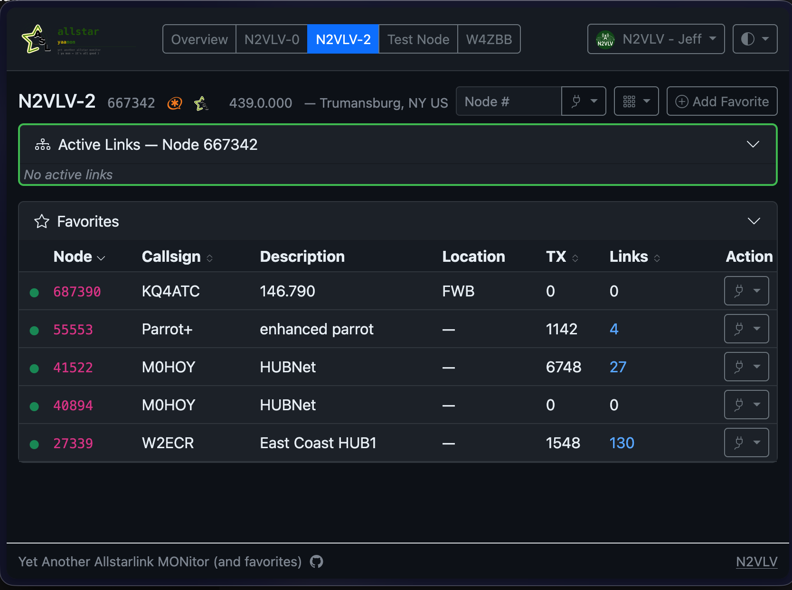

# YAAMon — Yet Another AllStar MONitor

YAAMon is a modern, responsive web application for managing and monitoring [AllStarLink](https://allstarlink.org) amateur radio nodes. It replaces the PHP/Apache-based [AllScan](https://github.com/davidgsd/AllScan) and [Allmon3](https://github.com/AllStarLink/Allmon3) with a single self-contained binary that needs no web server, no PHP runtime, and no external database engine. The interface works on desktops, tablets, and phones.



**Key differences from AllScan and Allmon3:**

- Single static binary — no web server, no PHP, no Node.js required
- Built-in TLS with automatic Let's Encrypt certificates
- Docker and docker-compose ready
- Multi-user with role-based access (superuser / admin / readwrite / readonly)
- Parallel AllStarLink stats fetching — no waiting for one node to block another
- Live dashboard with SSE-pushed updates (no page refresh needed)
- Encrypted backup and restore
- Multiple color themes including high-contrast

**Key differences from AllScan specifically:**

- Manages multiple Asterisk/AMI nodes from one interface

---

## Installation

### Option 1 — Debian / Ubuntu package (recommended for ASL3 nodes)

Download the `.deb` for your architecture from the [Releases page](https://github.com/jchonig/allstar-yaamon/releases/latest):

| Platform | File |
|----------|------|
| Raspberry Pi 3B+ / Zero 2 W / Pi 4 / Pi 5 | `yaamon_*_linux_arm64.deb` |
| x86-64 server / VM | `yaamon_*_linux_amd64.deb` |

```bash
# Example — replace version and arch as appropriate
wget https://github.com/jchonig/allstar-yaamon/releases/download/v1.0.0/yaamon_1.0.0_linux_arm64.deb
sudo dpkg -i yaamon_1.0.0_linux_arm64.deb
```

The package installs the binary to `/usr/local/bin/yaamon`, a systemd unit, and a starter config at `/etc/yaamon/config.yaml`. The service starts automatically on install.

```bash
# Check it started
sudo systemctl status yaamon

# View logs
sudo journalctl -u yaamon -f
```

Open `http://<your-node-ip>/` in a browser. On first visit you will be directed to the setup page to create your admin account.

### Option 2 — Pre-built binary (tarball)

Download the tarball for your platform from the [Releases page](https://github.com/jchonig/allstar-yaamon/releases/latest), extract, and run:

```bash
tar xzf yaamon_*_linux_arm64.tar.gz
sudo mv yaamon /usr/local/bin/
yaamon serve --config /etc/yaamon/config.yaml
```

For persistent operation copy the [contrib/yaamon.service](contrib/yaamon.service) systemd unit to `/etc/systemd/system/` and enable it:

```bash
sudo cp contrib/yaamon.service /etc/systemd/system/
sudo systemctl daemon-reload
sudo systemctl enable --now yaamon
```

### Option 3 — Docker

```bash
docker run -d \
  --name yaamon \
  --restart unless-stopped \
  -p 80:80 \
  -v /etc/yaamon:/etc/yaamon \
  -v /var/lib/yaamon:/var/lib/yaamon \
  ghcr.io/jchonig/allstar-yaamon:latest
```

Mount your config file at `/etc/yaamon/config.yaml` and a persistent data volume at `/var/lib/yaamon`. The database is created at `/var/lib/yaamon/yaamon.db` on first run.

### Option 4 — docker-compose

```yaml
services:
  yaamon:
    image: ghcr.io/jchonig/allstar-yaamon:latest
    restart: unless-stopped
    ports:
      - "80:80"
      - "443:443"
    volumes:
      - ./config:/etc/yaamon       # config.yaml lives here
      - yaamon-data:/var/lib/yaamon  # named volume for the SQLite database
    environment:
      # Override any config.yaml value with YAAMON_<SECTION>_<KEY>
      - YAAMON_LOG_LEVEL=info

volumes:
  yaamon-data:
```

A bind-mount directory works too — replace `yaamon-data:/var/lib/yaamon` with `./data:/var/lib/yaamon` if you prefer the database stored at a known path on the host.

To run on non-standard ports, map the host ports in `ports` and set matching values in `config.yaml` (or via environment variables):

```yaml
    ports:
      - "8080:8080"
      - "8443:8443"
    environment:
      - YAAMON_SERVER_HTTP_PORT=8080
      - YAAMON_SERVER_HTTPS_PORT=8443
```

```bash
docker compose up -d
docker compose logs -f
```

---

## Configuration

Copy `config.yaml.example` to `config.yaml` and edit it before first run:

```yaml
server:
  http_port: 80
  https_port: 443

tls:
  mode: disabled             # disabled | self_signed | provided | acme

db:
  path: /var/lib/yaamon/yaamon.db

log:
  level: info
```

Any config value can be overridden with an environment variable using the pattern `YAAMON_<SECTION>_<KEY>` — for example `YAAMON_DB_PATH=/var/lib/yaamon/yaamon.db`.

See [`config.yaml.example`](config.yaml.example) for all options including TLS and UI footer customization.

---

## TLS / HTTPS

YAAMon has four TLS modes set in `config.yaml`:

| Mode | When to use |
|------|-------------|
| `disabled` | HTTP only — local LAN, behind a reverse proxy |
| `self_signed` | Generates a self-signed cert on first run — quick setup, browser warning |
| `provided` | Supply your own `cert_file` and `key_file` |
| `acme` | Automatic Let's Encrypt via ACME — requires a public domain name and port 80 reachable from the internet |

> **Planned**: DNS-01 ACME challenge support (no port 80 required, wildcard certificates) and automatic hot-reload of externally-managed certificates (e.g. from certbot) are planned for a future release.

---

## Building from Source

Builds run inside Docker — Go does not need to be installed on the host. Only Docker is required.

```bash
git clone https://github.com/jchonig/allstar-yaamon.git
cd allstar-yaamon
make build               # builds a Docker image for the current platform
make test                # unit + integration tests (also runs in Docker)
make snapshot            # GoReleaser cross-compile snapshot (all platforms + .deb)
make test-deb            # build snapshot .deb and run integration tests against it
```

---

## Systemd Quick Reference

```bash
sudo systemctl start yaamon
sudo systemctl stop yaamon
sudo systemctl restart yaamon
sudo systemctl status yaamon
sudo journalctl -u yaamon -f        # live logs
sudo journalctl -u yaamon --since today
```

---

## AMI Security Note

The Asterisk Manager Interface (AMI) used to connect to your nodes transmits credentials and commands in plain text by default. **Do not expose AMI port 5038 directly to the internet.** For remote nodes, use one of:

- A VPN (WireGuard, OpenVPN) between the YAAMon host and the remote node
- An SSH tunnel: `ssh -L 5038:localhost:5038 user@remote-node`

See [DOCUMENTATION.md](DOCUMENTATION.md) for detailed setup guidance.

---

## Migrating from AllScan or Allmon3

YAAMon has built-in import support — no conversion scripts needed.

**From Allmon3**: go to **Admin → Nodes**, click **Import from Allmon3**, and upload your `allmon3.ini` file. YAAMon lists the nodes found; select the ones to import and confirm. AMI credentials are read from the file.

**From AllScan**: go to **Favorites**, click **Import**, and upload your `favorites.ini` file. YAAMon extracts node numbers and labels (splitting callsign from description where possible) and imports them as favorites for the selected node.

YAAMon uses its own database and can run alongside AllScan or Allmon3 during transition.

---

## Bugs & Discussion

- **Bug reports**: [GitHub Issues](https://github.com/jchonig/allstar-yaamon/issues)
- **Discussion & questions**: [GitHub Discussions](https://github.com/jchonig/allstar-yaamon/discussions)

Please include your YAAMon version (`yaamon --version`), OS, and relevant log output when filing a bug.

---

## License

BSD 3-Clause — see [LICENSE](LICENSE).
