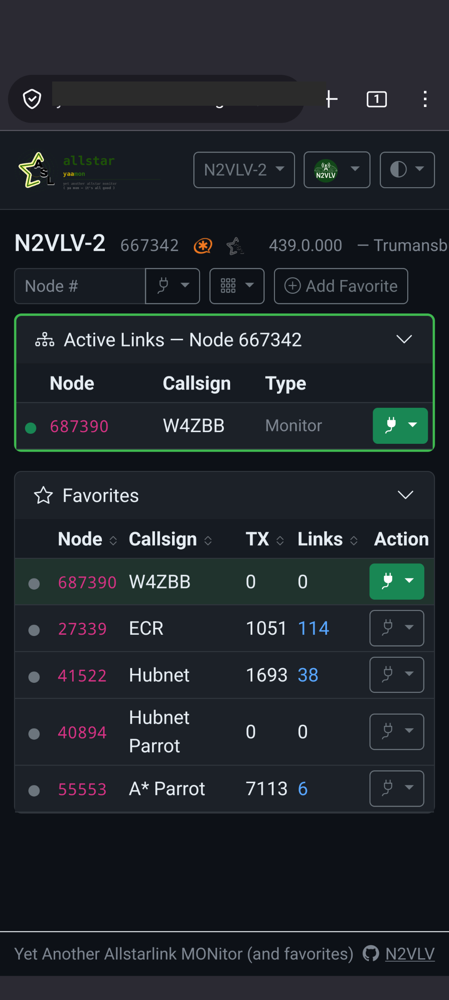

# YAAMon — Yet Another AllStar MONitor

YAAMon is a modern, responsive web application for managing and monitoring [AllStarLink](https://allstarlink.org) amateur radio nodes. It replaces the PHP/Apache-based [AllScan](https://github.com/davidgsd/AllScan) and [Allmon3](https://github.com/AllStarLink/Allmon3) with a single self-contained binary that needs no web server, no PHP runtime, and no external database engine. The interface works on desktops, tablets, and phones.

<table>
<tr>
<td></td>
<td></td>
</tr>
</table>

**Key differences from AllScan and Allmon3:**

- Single static binary — no web server, no PHP, no Node.js required
- Built-in TLS with automatic Let's Encrypt certificates and HTTP/3 (QUIC)
- Docker and docker-compose ready
- Multi-user with role-based access (superuser / admin / readwrite / readonly)
- Adaptive AllStarLink stats fetching — deduplicates across all open dashboards, switches between bulk and individual endpoints automatically to stay within API rate limits
- Live dashboard with SSE-pushed updates (no page refresh needed)
- Passkey / WebAuthn (FIDO2) authentication support
- Encrypted backup and restore
- Multiple color themes including high-contrast

**Key differences from AllScan specifically:**

- Manages multiple Asterisk/AMI nodes from one interface

---

## Installation

| Method | Best for |
|--------|----------|
| [Debian / Ubuntu package](https://yaamon.n2vlv.net/installation/deb/) | ASL3 nodes (Raspberry Pi, x86 server) — recommended |
| [Pre-built binary](https://yaamon.n2vlv.net/installation/binary/) | Non-Debian Linux, manual systemd setup |
| [Docker](https://yaamon.n2vlv.net/installation/docker/) | Quick start, isolated environment |
| [docker-compose](https://yaamon.n2vlv.net/installation/docker-compose/) | Production Docker deployments |
| [Building from source](https://yaamon.n2vlv.net/installation/building/) | Development, custom builds |

### Quick start — Debian / Ubuntu (APT repository)

```bash
curl -fsSL https://yaamon.n2vlv.net/gpg.key \
  | sudo gpg --no-default-keyring \
      --keyring gnupg-ring:/usr/share/keyrings/yaamon-archive-keyring.gpg \
      --import
sudo chmod 644 /usr/share/keyrings/yaamon-archive-keyring.gpg
echo "deb [signed-by=/usr/share/keyrings/yaamon-archive-keyring.gpg] https://yaamon.n2vlv.net stable main" \
  | sudo tee /etc/apt/sources.list.d/yaamon.list
sudo apt update && sudo apt install yaamon
```

Upgrades: `sudo apt update && sudo apt upgrade yaamon`

See [full installation docs](https://yaamon.n2vlv.net/installation/deb/) for manual `.deb` download and other options.

Access at `http://<your-node-ip>:8080/`. Default port is **8080** to coexist with ASL3's Apache on port 80.

### Quick start — Docker

```bash
docker run -d --name yaamon --restart unless-stopped \
  -p 8080:8080 \
  -v /etc/yaamon:/etc/yaamon \
  -v /var/lib/yaamon:/var/lib/yaamon \
  ghcr.io/jchonig/yaamon:latest
```

---

## Documentation

Full documentation is at **[yaamon.n2vlv.net](https://yaamon.n2vlv.net)**.

- [Installation](https://yaamon.n2vlv.net/installation/) — all installation methods, migration from AllScan/Allmon3
- [Configuration](https://yaamon.n2vlv.net/configuration/) — config file reference, TLS, AMI, authentication
- [User Guide](https://yaamon.n2vlv.net/user-guide/) — dashboard, favorites, profile, passkeys
- [Security](https://yaamon.n2vlv.net/security/) — web security, AMI security
- [Troubleshooting](https://yaamon.n2vlv.net/troubleshooting/) — debug logging, common issues
- [CLI Reference](https://yaamon.n2vlv.net/reference/cli/) — all `yaamon` subcommands and flags
- [Design](https://yaamon.n2vlv.net/design/) — architecture, database schema, API, CI/CD

---

## Migrating from AllScan or Allmon3

See [Migration](https://yaamon.n2vlv.net/installation/migration/) — built-in import support, no conversion scripts needed.

---

## Bugs & Discussion

- **Bug reports**: [GitHub Issues](https://github.com/jchonig/allstar-yaamon/issues)
- **Discussion & questions**: [GitHub Discussions](https://github.com/jchonig/allstar-yaamon/discussions)

Please include your YAAMon version (`yaamon --version`), OS, and relevant log output when filing a bug.

---

## License

BSD 3-Clause — see [LICENSE](LICENSE).
