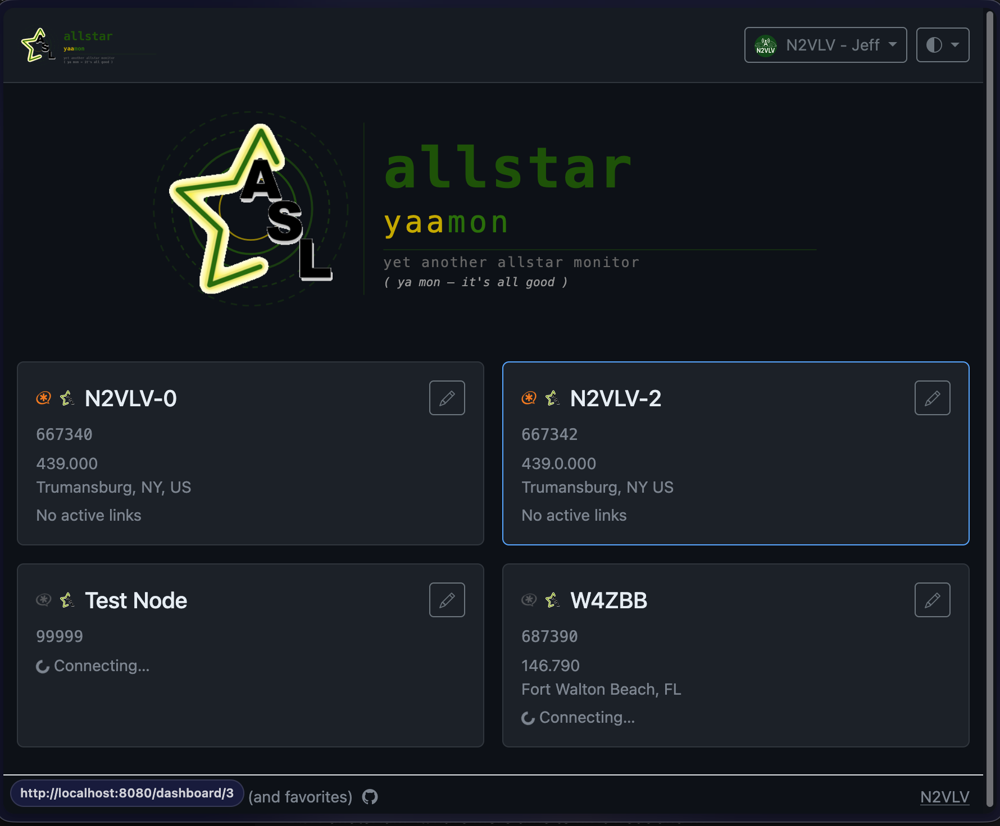

# Overview Page

The Overview page is shown when you have more than one node and click **Overview** in the nav. It displays a summary card for each node showing:

- Connection status (green/red dot)
- Node number and name
- Number of active connections
- Whether the node is currently keyed

Click a node card to jump to that node's full dashboard.
