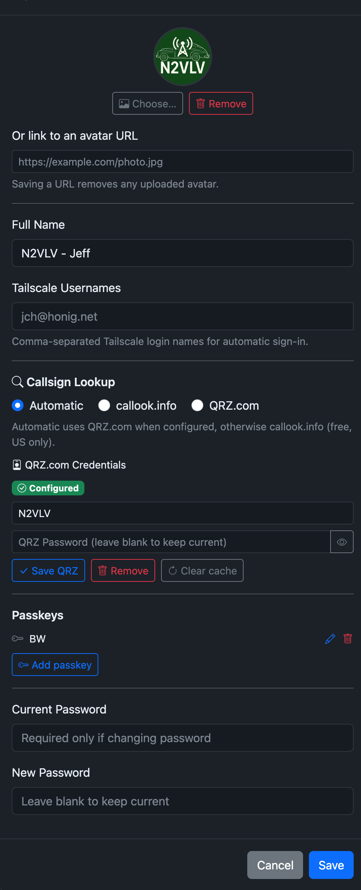
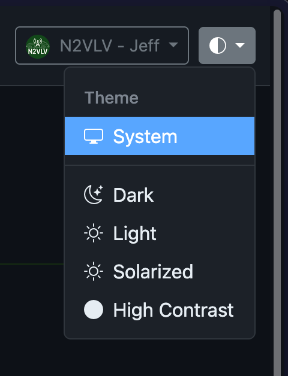

# Your Profile

Click your name or avatar in the top-right corner and choose **My Profile**.

## Avatar

You can set an avatar two ways:

- **Upload an image** — click **Choose…**, pick a PNG, JPEG, GIF, or WebP image (max 2 MB), then click **Upload**. The image is stored in YAAMon's database.
- **Link to a URL** — paste an external image URL into the "Or link to an avatar URL" field and save. The browser fetches the image directly from that URL on each page load.

Click **Remove** to clear the avatar entirely.

## Full name

Enter your name in the **Full Name** field. It appears in the navbar dropdown in place of your username.

## Password

Enter your current password and a new password to change it. Passwords must be at least 8 characters. Leave both fields blank to keep the current password.

> Accounts created automatically by proxy auth (OAuth2) have password-based login disabled. The password fields are not available for those accounts. Use `yaamon user passwd <username>` from the CLI to re-enable local login.

## Tailscale usernames

If your site uses [Tailscale authentication](../configuration/tailscale.md), enter your Tailscale login name (e.g. `jch@honig.net`) here. Separate multiple logins with commas. When a request arrives from Tailscale with a matching identity header, you will be logged in automatically without a password.

## Callsign lookup

Choose which source to use for callsign lookups on the dashboard:

| Option | Description |
|--------|-------------|
| **Automatic** | Uses QRZ.com when credentials are configured, otherwise callook.info (US only) |
| **callook.info** | Always use callook.info (free, US callsigns only) |
| **QRZ.com** | Always use QRZ.com (requires a QRZ.com subscription) |

To configure QRZ.com credentials, expand **QRZ.com Credentials**, enter your QRZ.com username and password, and click **Save QRZ**. Click **Remove** to clear stored credentials, or **Clear cache** to force fresh lookups.

See [Callsign Lookup](callsign-lookup.md) for details on caching and fallback behaviour.

## Passkeys

The **Passkeys** section shows all registered passkeys for your account.

### Registering a passkey

1. Click **Add passkey**.
2. Follow the browser prompt to create the credential (Touch ID, Face ID, Windows Hello, YubiKey, or a FIDO2 password manager like Bitwarden).
3. Optionally give the passkey a descriptive name (e.g. "MacBook Pro Touch ID").

### Signing in with a passkey

On the login page, click **Sign in with passkey**. The browser presents stored credentials for the site — no username or password needed.

### Managing passkeys

- **Rename** — click the pencil icon next to any passkey.
- **Delete** — click the trash icon.

#### Safety guard

If a passkey is the last one on an account **and** the account has no password set, deletion is blocked with a 409 error. Set a password first, or add a second passkey, before removing the last one.

See [Passkeys configuration](../configuration/passkeys.md) for RPID/origins setup.

## Themes

Click the half-circle icon in the top-right corner to switch themes:

| Theme | Description |
|-------|-------------|
| **System** | Follows your OS dark/light mode preference |
| **Dark** | Dark background (default) |
| **Light** | Light background |
| **Solarized** | Solarized color palette |
| **High Contrast** | Maximum contrast for accessibility |

Your choice is saved in browser local storage and persists across sessions.
